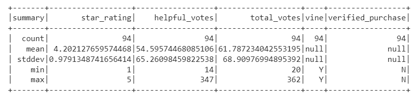
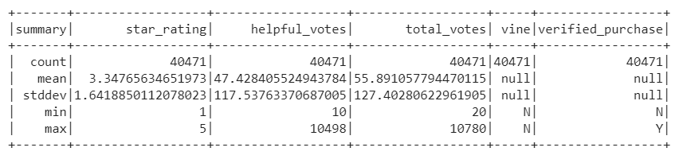

# Amazon_Vine_Analysis

## Overview

The Amazon Vine program is a service that allows manufacturers and publishers to receive high-quality reviews for their products. Companies pay a small fee to Amazon and provide products to Amazon Vine members free of charge, in exchange for a review of the product (referred to in this code as "paid reviews"). This analysis uses a dataset of reviews of video games to determine whether Amazon Vine reviewers tend to give products higher star ratings than regular reviews (referred to in the code as "unpaid reviews".)

- Note: this repository also contains code and a schema for extracting and transforming the dataset in PySpark, connecting to an AWS RDS instance, and loading the transformed data into pgAdmin. Note that this example code uses a different dataset- mobile apps rather than video games.

## Results

### Vine Review Findings

- The dataset includes 94 Vine reviews, 48 of which gave the products 5 stars.
- 51.1% of Vine reviews were 5 stars.
- See the table below for a summary of Vine reviews including the average star rating:

### Regular Review Findings

- The dataset includes 40,471 regular reviews, 15,663 of which gave the products 5 stars.
- 38.7% of regular reviews were 5 stars.
- See the table below for a summary of regular reviews:

## Summary

There does appear to be a slight positive bias in star rating from reviewers who received a free product. This could be explored further by analyzing the number of 1 star reviews to see if Vine members are less likely to rate a product extremely poorly, in addition to more likely to give an excellent rating.
